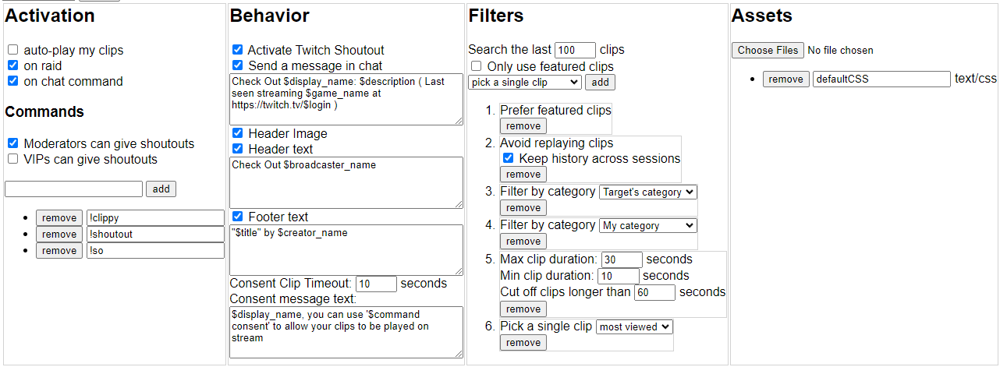
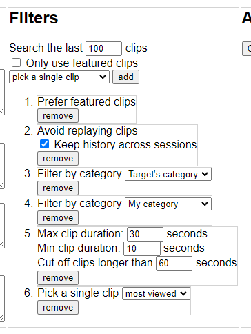

# SugoiClippy
Play Twitch Clips on demand
## Features
- Consent: Clippy requires that the user who receives a shoutout gives their consent before playing their clips.
- Featured Clips: By default, Clippy will prefer to use only featured clips, so you don't end up with random garbage or accidental clips on stream.
- Full Control: You decide how clips are selected via a drag&drop filter menu, offering the most control of any clip player.
- Full Customization: You can add fonts, CSS, JS modules, or even full HTML documents to your config to customize Clippy to your brand.
## Usage
To use, go to https://sugoidogo.github.io/clippy/v3 and authorize clippy.
Type in a name for your clippy instance and hit `Create New Instance`.
Then adjust the settings to your liking, and click the `Copy Overlay URL` button.
Use it as a browser source in obs or any other streaming software.
Your settings are stored server-side, you only need to refresh the source to load changed settings.
## Support
Support information for all my software is on my [GitHub profile](https://github.com/sugoidogo)
## Preview
### All Settings

### Drag and Drop Filters List

### Default Layout

